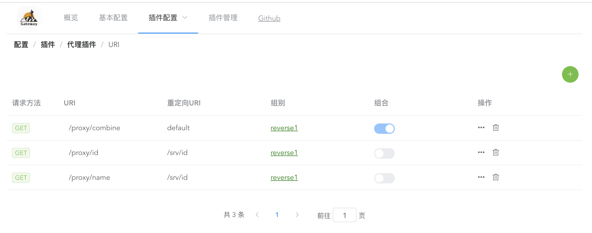
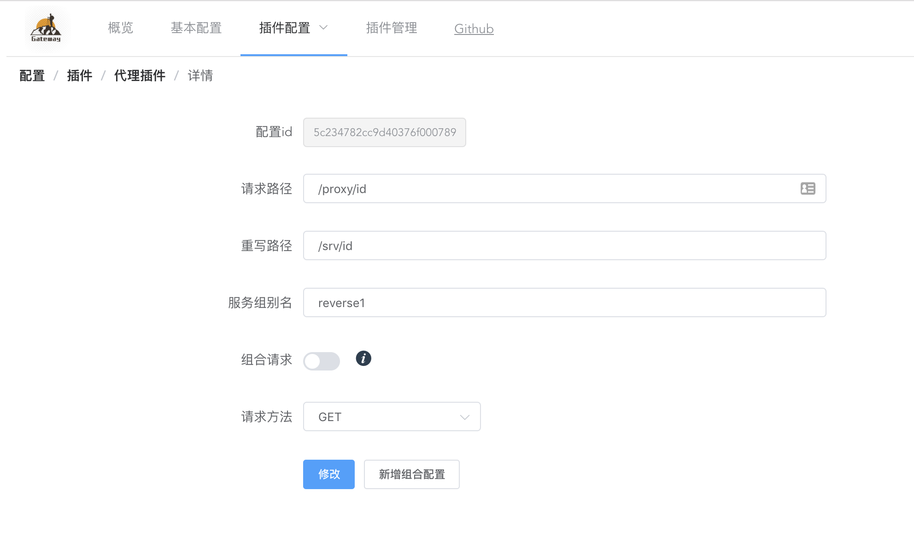
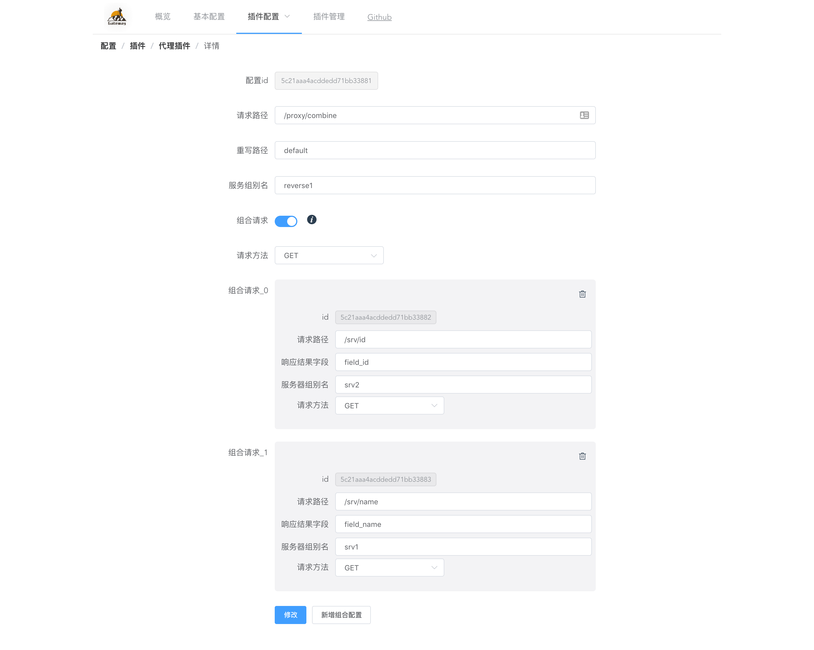
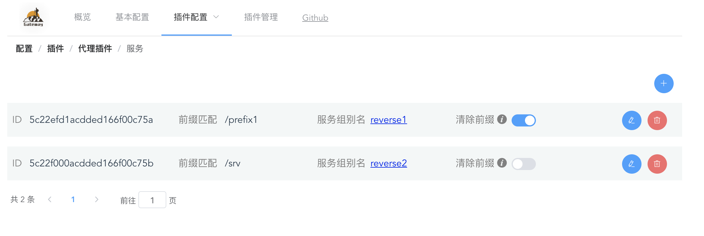
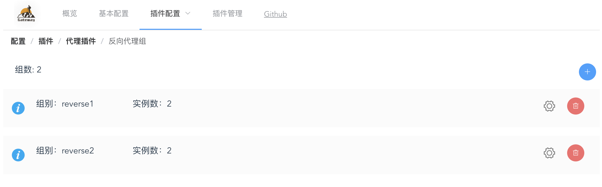
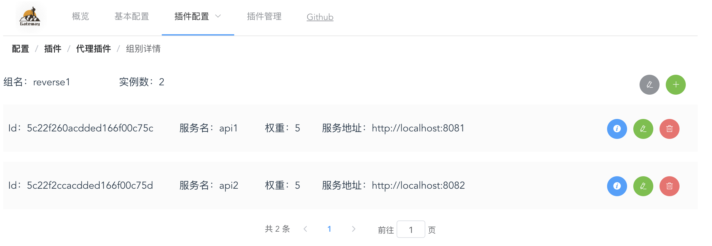
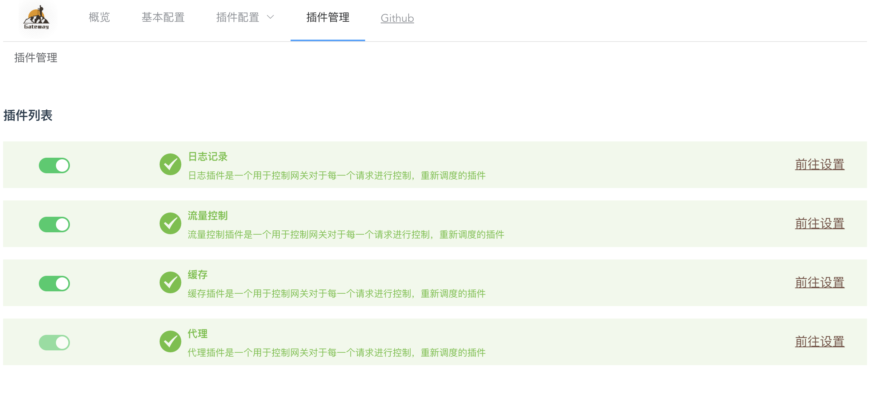

# gateway

API网关程序，用于实现多个服务访问控制，精简单个服务的功能。主要功能参见: [主要功能](#主要功能)

## 安装使用

1. [下载](https://github.com/yeqown/gateway/releases)二进制文件
2. [下载](https://github.com/yeqown/gateway/releases)对应页面打包文件 - webview.tar
3. 直接运行二进制文件
```sh
./gateway
```
4. 解压页面打包文件，并启动一个文件服务器
```sh
tar zxvf webview.tar
cd webview && python3 -m http.server
```

## Todos

- [x] HTTP反向代理及负载均衡
- [x] API缓存支持POST，PUT等带有body的请求
- [ ] 横向扩展master-slave 模式
- [ ] 权限管理（RBAC）
- [x] 流量控制（令牌桶算法）
- [x] 插件模式（支持动态关闭与开启）
- [x] 插件配置及时更新，不需重启网关加载
- [ ] 支持Docker部署
- [ ] 添加更多的测试代码，hah

## 开发环境

* MongoDB
* Go1.11.1
* Node v1.10.1 (npm: 6.4.1)

## 主要功能

### 1. 代理

#### 1.1 URI代理 


##### 1.1.1 直接代理


##### 1.1.2 组合代理


#### 1.2 Server代理
服务代理需要配置*前缀*、*服务组名*、*是否清除前缀*。如图配置了`prefix: /srv` & `group: reverse1` & `need_strip_prefix: false`。那么`/srv/user/name`会被转发到`reverse1`组内的某一个实例上，且URI会被转换成`/user/name`，也就是说该实例并不会接收到`/prefix/user/name`



#### 1.3 反向服务实例组
代理功能基础配置部分，每个服务实例都需要配置服务地址，端口及权重。同一组的服务会在代理的时候根据权重均衡调度保证压力分配均匀。




### 2.插件管理
插件管理，可以动态启用或者禁用插件即时生效



### 3. 缓存规则
采用正则表达式对于URI进行缓存，目前不支持对于缓存时间和介质的配置。